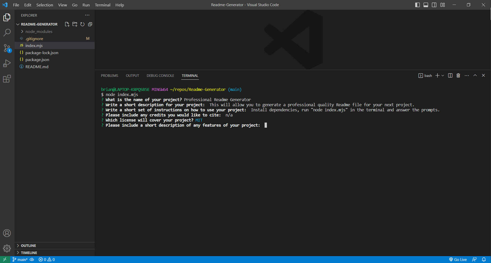

# Professional Readme Generator

## Description

This project will allow you to generate a professional quality Readme file for your GitHub projects. It is important to provide a thorough readme for all of your work, and this makes the process quick and easy, and makes sure you include all of the information that is required. Creating this project gave me the opportunity to work with Inquirer.js and to experiment with the different prompt types, as well as wrapping them in functions to provide multiline answers to certain prompts. This creates a clean and functional readme file every time, and hopefully will save others time as well.

## Table of Contents (Optional)

If your README is long, add a table of contents to make it easy for users to find what they need.

- [Installation](#installation)
- [Usage](#usage)
- [Credits](#credits)
- [License](#license)
- [Features](#features)
- [Contribute](#contribute)
- [Questions](#questions)
- [Tests](#tests)

## Installation

 Open the project in your preferred coding app. Run "npm init -y" in the terminal. Run "npm install inquirer" in the terminal. Run "node index.mjs" in the terminal.

## Usage

Open the project in your preferred coding app, install the necessary packages and run "node index.mjs" in the terminal. Answer the prompts and your answers will be generated in the README.md file.

https://github.com/brian-wastle/Readme-Generator

## Credits

https://github.com/SBoudrias/Inquirer.js/tree/master/packages/inquirer/examples

## License

This project is covered under the MIT license.

## Features

Installation steps can be entered line-by-line and will display with line breaks in between. User email and GitHub repositories will be linked in the Readme file as well.

## Contribute

n/a

## Questions

Please contact me with additional questions at [brian.wastle1@gmail.com](mailto:brian.wastle1@gmail.com)

Please check out my other projects at [https://www.github.com/brian-wastle](https://www.github.com/brian-wastle)

## Tests

n/a

